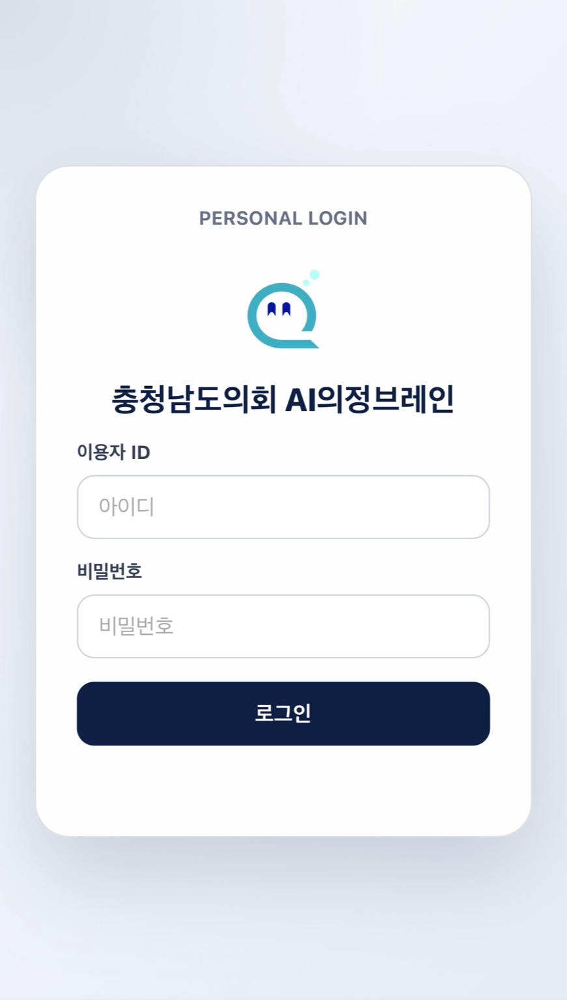
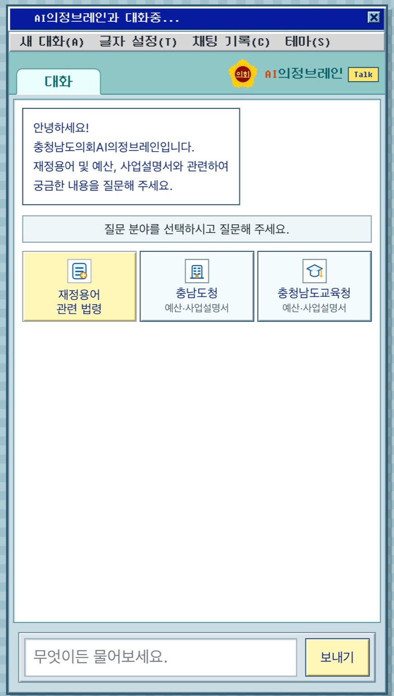
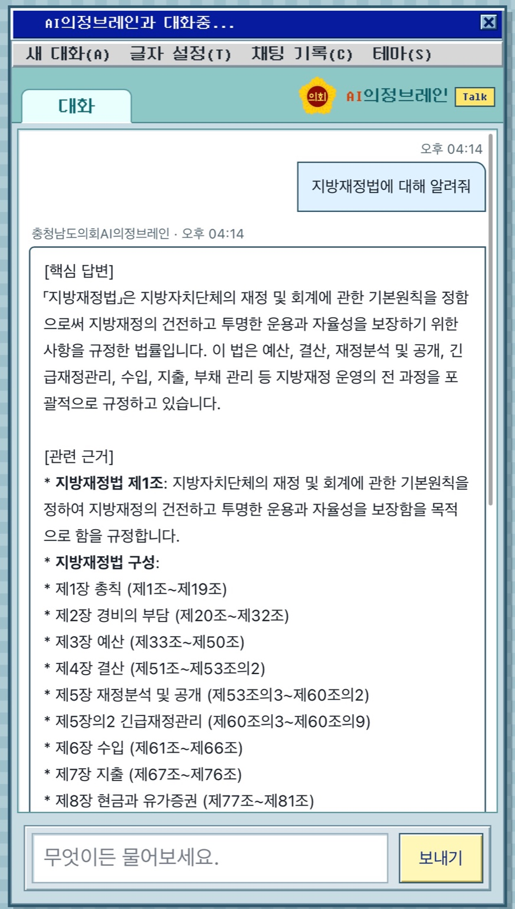
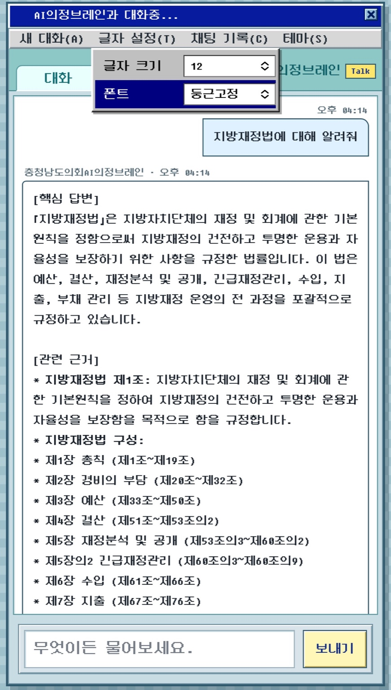
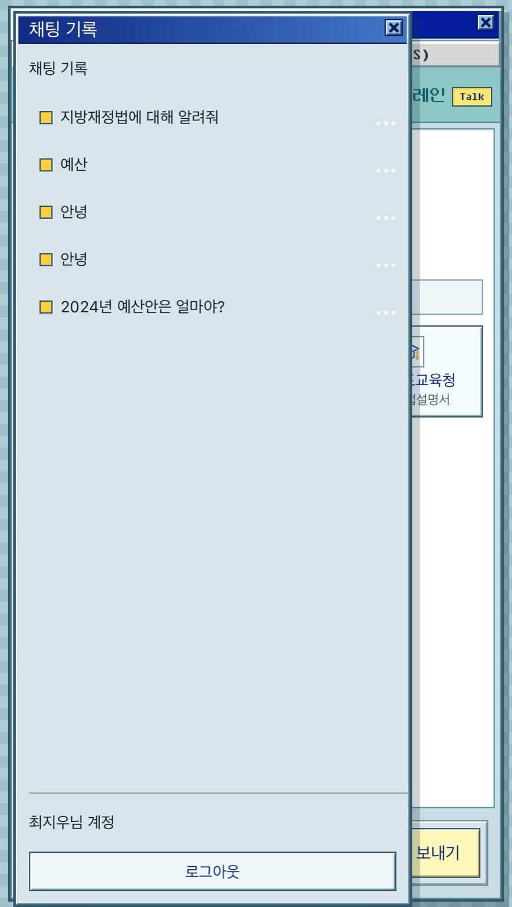
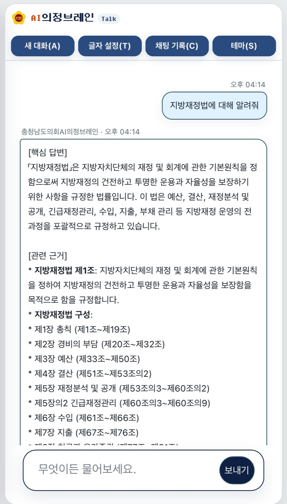
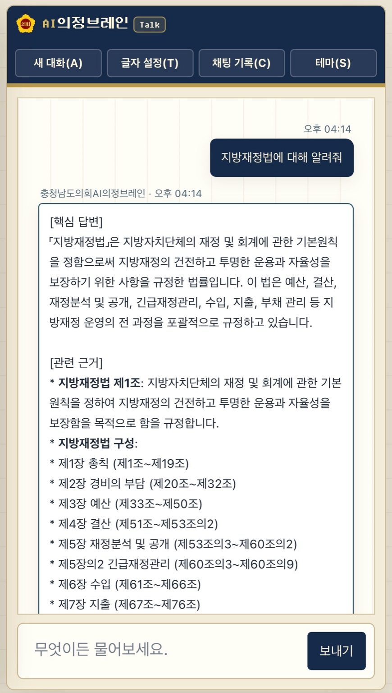

# 충청남도의회 AI의정브레인 챗봇

충청남도의회 의정 업무와 예산 검토를 보조하는 웹 기반 AI 챗봇입니다. 로그인 후 재정용어, 관련 법령, 충남도청 예산·사업설명서, 충청남도교육청 예산·사업설명서를 선택해 질문할 수 있습니다.

## 화면 미리보기

### 로그인

기본 로그인 화면은 테마 설정과 무관하게 고정된 기본 스타일로 표시됩니다.



### 메인 화면

질문 분야를 먼저 선택한 뒤 하단 입력창에서 질문을 전송합니다.



### AI 답변

사용자 질문과 AI 답변을 채팅 형태로 보여주며, 답변에는 핵심 답변과 관련 근거를 함께 표시합니다.



### 글자 설정

상단 메뉴에서 글자 크기와 폰트를 조정할 수 있습니다.



### 채팅 기록

이전 대화는 채팅 기록 패널에서 다시 열람할 수 있으며, 로그인 사용자별로 관리됩니다.



### 기본테마

업무용 환경에 맞춘 간결한 기본테마를 제공합니다.



### 의회테마

문서 검토 화면에 어울리는 의회테마를 제공합니다.



## 주요 기능

- 세션 기반 로그인 및 사용자 인증
- 관리자 계정의 사용자 생성, 수정, 삭제
- 분야별 AI 질의응답
- 사용자별 채팅 기록 저장
- PDF, DOCX, TXT, MD 파일 업로드 및 첨부 질의
- 레트로, 기본테마, 의회테마 전환
- 글자 크기와 폰트 설정
- `docs/` PDF 문서 ChromaDB 인덱싱
- 모바일 화면과 키보드 입력 대응

## 프로젝트 구조

```text
chatbot/
├── rag_server.py          # Flask API 서버 및 정적 파일 서빙
├── auth_store.py          # 사용자, 대화, 업로드 파일 DB 로직
├── llm_gateway.py         # LLM API 호출 로직
├── index_docs.py          # docs PDF 문서 인덱싱 스크립트
├── assembly_ai.db         # SQLite 사용자/대화/업로드 메타데이터 DB
├── docs/                  # 인덱싱할 원본 PDF 문서
├── chroma_db/             # ChromaDB 벡터 저장소
├── uploads/               # 사용자 업로드 파일 저장소
├── screenshot/            # README용 화면 캡처
├── static/                # 실제 웹 UI 정적 파일
│   ├── index.html
│   ├── style.css
│   ├── script.js
│   ├── manifest.webmanifest
│   └── *.svg, *.png
└── new_ui_starter/        # 별도 UI 실험/초기 코드
```

## 실행 방법

프로젝트 루트에서 실행합니다.

```bash
cd /home/ahye/services/chatbot
LLM_API_KEY=<LLM_API_KEY> SECRET_KEY=<세션_시크릿> python3 rag_server.py
```

기본 접속 주소:

```text
http://localhost:3000
```

포트를 바꿔 실행하려면:

```bash
PORT=8080 LLM_API_KEY=<LLM_API_KEY> SECRET_KEY=<세션_시크릿> python3 rag_server.py
```

## 필요 패키지

서버 실행과 파일 처리에 필요한 기본 패키지입니다.

```bash
pip install flask flask-cors requests pypdf
```

문서 인덱싱까지 사용할 경우 추가 패키지가 필요합니다.

```bash
pip install chromadb FlagEmbedding
```

## 관리자 계정

최초 실행 시 관리자 계정이 자동 생성됩니다. 운영 환경에서는 기본값을 쓰지 말고 환경 변수로 변경하세요.

```bash
ADMIN_USERNAME=<관리자_아이디> ADMIN_PASSWORD=<관리자_비밀번호> LLM_API_KEY=<LLM_API_KEY> python3 rag_server.py
```

## 환경 변수

```text
PORT                  서버 포트, 기본값 3000
STATIC_DIR            정적 파일 폴더, 기본값 static
UPLOAD_DIR            업로드 파일 저장 폴더, 기본값 uploads
APP_DB_PATH           SQLite DB 경로, 기본값 assembly_ai.db
SECRET_KEY            Flask 세션 키
ADMIN_USERNAME        최초 관리자 아이디, 기본값 admin
ADMIN_PASSWORD        최초 관리자 비밀번호, 기본값 admin1234
LLM_BASE_URL          LLM API 주소
LLM_API_KEY           LLM API 키
LLM_MODEL             기본 모델명
LLM_MAX_TOKENS        최대 응답 토큰 수
UPLOAD_CONTEXT_CHARS  첨부파일 참고 텍스트 최대 길이
```

## 문서 인덱싱

`docs/` 폴더에 PDF 파일을 넣고 인덱싱 스크립트를 실행합니다.

```bash
python3 index_docs.py
```

인덱싱 결과는 `chroma_db/` 폴더에 저장됩니다.

## 주요 API

```text
GET  /health                 서버 상태 확인
POST /api/login              로그인
POST /api/logout             로그아웃
GET  /api/session            현재 로그인 세션 확인
GET  /models                 LLM 모델 목록
POST /chat                   챗봇 질의
GET  /api/conversations      대화 목록 조회
POST /api/conversations      대화 저장
POST /api/files              파일 업로드
GET  /api/files/<file_id>    업로드 파일 열기
```

## UI 파일

웹 화면은 `static/` 폴더에서 관리합니다.

- `index.html`: 화면 구조
- `style.css`: 전체 스타일과 테마
- `script.js`: 로그인, 대화, 기록, 테마, 파일 업로드 동작
- `manifest.webmanifest`: PWA 메타데이터와 아이콘 설정

## 참고

- `uploads/`에는 사용자별 업로드 파일이 저장됩니다.
- `assembly_ai.db`에는 사용자, 대화 기록, 업로드 파일 메타데이터가 저장됩니다.
- `chroma_db/`는 문서 인덱싱 결과이므로 재생성이 가능합니다.
- 루트 기준 실행은 `rag_server.py`를 사용합니다.

## 보안 주의

- API 키, 세션 키, 관리자 비밀번호는 코드에 직접 적지 말고 환경 변수로만 설정합니다.
- `.env`, `.venv/`, `assembly_ai.db`, `uploads/`, `chroma_db/`, `.claude/`는 GitHub에 올리지 않습니다.
- 실수로 API 키를 커밋했다면 파일에서 지우는 것만으로는 부족하므로 해당 키를 즉시 폐기하고 새 키를 발급하세요.
